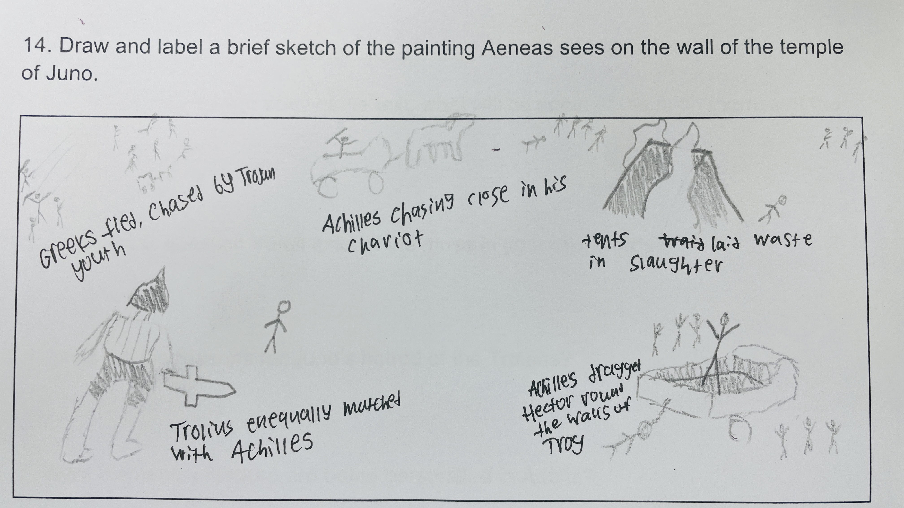

# Aeneid Book I Project

1. The poem will discuss topics of War and the power & anger of the gods.

2. Vergil wants the Muse to tell him what had caused the events of the story, and help him in his writing.

3. Juno dislikes the Trojans for the judgement of Paris in the beauty contest, and Jupiter taking Ganymede from Troy as his cupbearer, which she was jealous of.

4. Aeolia is described with great emphasis on storms and wind.

5. Aeolus would summon up a storm to kill the trojans in exchange for Juno having one of her most beautiful Nymphs marry Aeolus.

6. Aeneas seems defeated and jealous of the others who died in the war, saying 'Oh, three, four times fortunate were those who changed to die in fron of their father's eyes under Troy's high walls!', which seems ironic considering he is fortunate enough to be one of the few Trojans still alive after the war.

7. Neptune seems rather calm until realizing Juno and Aeolus' anger had caused the storm on the seas he had controlled, contrasting with the intense anger of Juno causing the storm.

8. Aeneas makes his speech to try to invoke bravery and endurance in his comrades, saying they have endured worse before and will be able to arrive at better days founding Troy once again in Latium, but personally feels defeated and painful inside for the misfortune that has happened to them.

9. Venus is portrayed as sorrowful for what has happened to her son Aeneas, and asks that Jupiter fix it, and Jupiter is portrayed as having been betrayed by Juno in her interference with the fates which are solely controlled by Jupiter, indicating gender bias with Jupiter having sole reign over the fate of humanity.

10. Jupiter mentions the story of Romulus and Remus and their founding of rome, as well as mentioning the birth of Julius Caesar and Augustus, who are to be emperors of Rome, and makes mention of Juno's gain in favor with the romans.

11. Venus disguises herself as a Spartan when meeting Aeneas, and Aeneas ironicly says she looks and talks like a goddess, which is ironic since she is actually Venus posing as the spartan.

12. Dido also escapes from violence happening at home, and leaves to form a new city like Aeneas is currently doing, when she leaves the Kingdom of Tyre controlled by her brother.

13. Aeneas is envious seeing Dido's city of Carthage thriving with people, building houses, walls, and temples, and wishes to create a city like that for the future Romans.

14. 

15. They were confused in the moment and wanted to blend in in case they face agression from the people of Carthage, but their fears were unfounded as Venus was ensuring their safety from Dido.

16. Venus send cupid disguised as Ascanius to trick Dido into falling in love with Aeneas.
